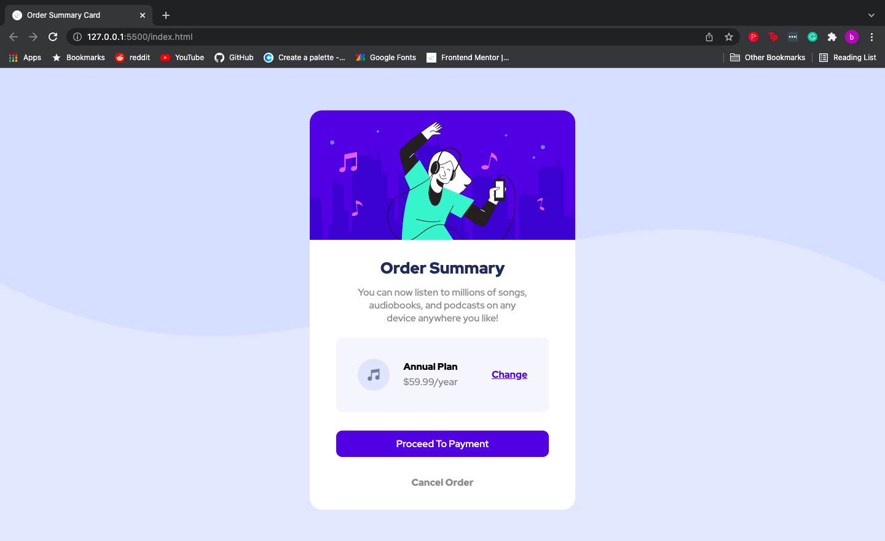

# Frontend Mentor - Order summary card solution

This is a solution to the [Order summary card challenge on Frontend Mentor](https://www.frontendmentor.io/challenges/order-summary-component-QlPmajDUj). Frontend Mentor challenges help you improve your coding skills by building realistic projects.

## Table of contents

- [Overview](#overview)
  - [The challenge](#the-challenge)
  - [Screenshots](#screenshots)
  - [Links](#links)
- [My process](#my-process)
  - [Built with](#built-with)
  - [What I learned](#what-i-learned)
  - [Continued development](#continued-development)
  - [Useful resources](#useful-resources)
- [Author](#author)

## Overview

I originally chose to tackle this challenge as my first project, but after facing a few difficulties and realising i was out of my depth, I decided to come back to it after I had learnt more.

This challenge was a good excersise for me to practise using the flexbox model and to see how much I had learnt since putting this project on hold.

### The challenge

Users should be able to:

- See hover states for interactive elements

### Screenshots

- Below are screenshots of the desktop and mobile view of the project:




### Links

- Solution URL: (https://www.frontendmentor.io/solutions/order-summary-card-dVXrMCQNY)
- Live Site URL: (https://bradwishart.github.io/Order-Summary-Card/)

## My process

My process for this project follows the same process I usually follow when starting out

Initial Planning:

To start I look at the design files and make a plan, thinking in terms of layers and how the items need to be placed on the screen.

Fisrt Step:

I started by writing out the basic HTML to give the web page some stucture.

Then I created an external css file, positioned the background element and centered it on the screen. Next the background colour was applied to finish the background off.

Second Step:

I created a div to contain all of the elements and text, positioned it in the center of the page and began to apply the code to fill it with content.

Third Step:

After positioning all of the contents using the flexbox model, I then started to apply the styles to the web page to match it to the design preview.

Forth Step:

I decided to add hover states to the active elements like the "change" link, "Proceed To Payment" button and the "Cancel Order" link.

The hover state enlarges the element when selected by the user to make it pop out slightly.

Example Code:

```css
.payment_button:hover {
  transform: scale(1.05);
}
```

This wasn't a neccesary part of the challenge but I thought it adds a nice touch.

Fith Step:

After I finished making the desktop version of the site I applied a media query to set up the mobile version, simply changing a few of the values for sizing to adjust to the smaller screen size.

### Built with

- Semantic HTML5 markup
- Flexbox Model

### What I learned

Throughout this project my understandings of the flex box model and responsive web design were tested.

The biggest challenge I faced was positioning the elements within the light grey box. But after researching and applying the techniques I found online I was able to arrange them properly.

During this process I reinforced alot of the responsive web design principles I've been studying, and I find that studying helps me to understand them partially but the real learning for me happens when I put it into practise.

### Continued development

In future I would like to work on learning and using CSS grid to complete certain aspects of projects.

My understanding of responsive design still needs work, I feel like im getting better with each project I take on.

In this project I took some of the advice from members of the front end mentor community and feel like my code has improved. I will be continuing to upload my project solutions to the website and applying any of the advice I recieve.

### Useful resources

- [Resource 1](https://www.freecodecamp.org/learn/responsive-web-design/css-flexbox/align-elements-using-the-align-items-property) - This resource helps me with the flex box model

## Author

- Brad Wishart

- Frontend Mentor - [@bradwishart](https://www.frontendmentor.io/profile/bradwishart)
